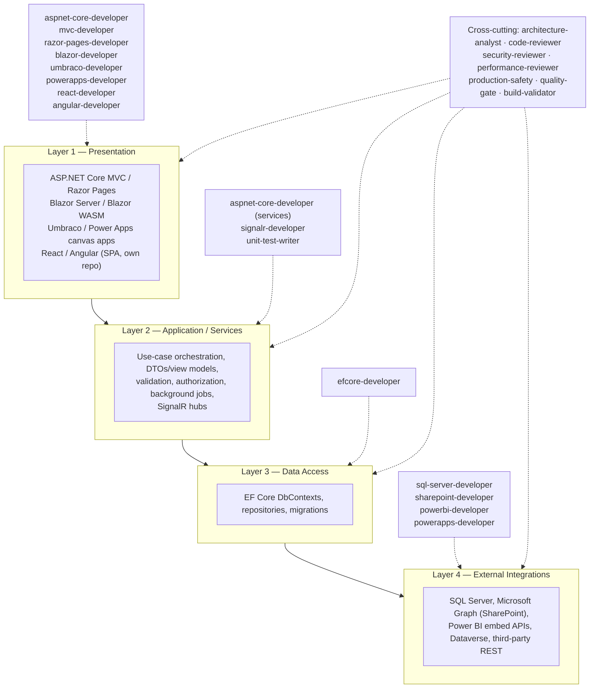
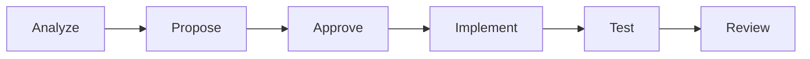
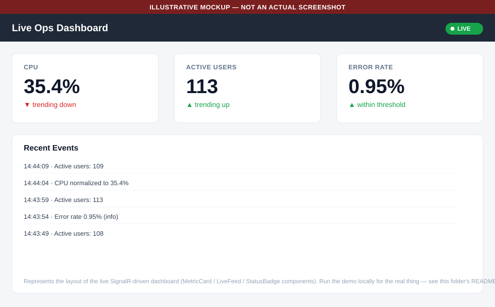
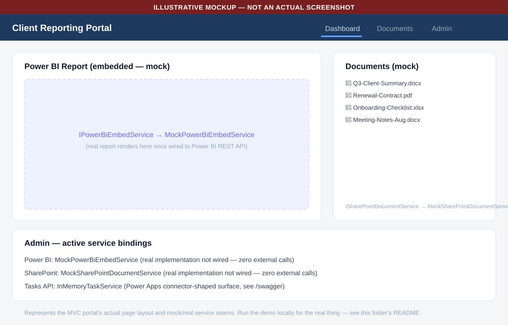

# Dotsquares AI Engineering Platform

**Author:** Arvind Kushwaha
**Company:** Dotsquares

A reusable AI-assisted SDLC framework for Dotsquares .NET delivery teams, built around Claude Code's agents/skills model. It packages specialized subagents, enforced workflow skills, a categorized prompt library, project-instruction templates, and three fully working demo projects into one repository that any Dotsquares .NET engagement can adopt.

## Purpose

Dotsquares delivers .NET solutions across 50+ developers and many concurrent client projects, spanning everything from legacy ASP.NET MVC to current ASP.NET Core, Blazor, and Power Platform work. Without a shared framework, each developer and each project ends up inventing its own way of prompting AI tools, with no consistent guardrails around when AI should propose versus implement, no shared vocabulary for what "done" means, and no common starting point for a new client repository. This platform exists to standardize that experience: the same disciplined workflow, the same stack-specific expertise, and the same starting templates, regardless of which developer or which client project is using them.

## Key capabilities

- **21 specialized agents** (`.claude/agents/`) — one per supported stack (including React and Angular) plus cross-cutting agents for architecture analysis, code review, security review, performance review, production safety, quality-gate aggregation, unit testing, and build validation.
- **18 enforced-workflow skills** (`.claude/skills/`) — slash-command workflows that walk a task through the platform's Analyze → Propose → Approve → Implement → Test → Review discipline instead of leaving it to individual discretion, with an optional streamlined single-approval mode and an optional Excel-based manual-QA tracking skill.
- **3 custom commands** (`.claude/commands/`) — explicit, never-auto-triggered routing shortcuts (`/fastfix`, `/safefeature`, `/review`) over the same agents/skills, distinct from skills' auto-trigger behavior.
- **An optional hooks-based technical backstop** (`templates/hooks/`) — a restricted-files guard enforced by a script, not just an instruction, for a project that wants that extra layer.
- **250 copy-paste-ready prompts** (`prompts/`) across 14 stack/category directories, each written to fit the same workflow discipline.
- **Project bootstrap templates** (`templates/`) — `CLAUDE.md` starting points, a permissions baseline, an MCP baseline, a restricted-files hook, review checklists, and 14 per-stack starter-project scaffolds.
- **3 independently buildable demo projects** (`demos/`) exercising the framework's patterns end to end, with real, passing automated test suites.
- **A non-negotiable workflow discipline** — `Analyze → Propose → Approve → Implement → Test → Review` — applied consistently across agents, skills, prompts, and templates.

## Architecture

Most Dotsquares .NET client engagements, regardless of front-end stack, converge on the same four-layer shape: presentation, application/services, data access, and external integrations. Requests flow top to bottom, and each layer depends only on the layer(s) below it. The platform's stack-specific agents are scoped to the layer(s) they're expert in, so invoking the right agent means getting advice grounded in that layer's real constraints. Full detail, including how each layer maps to concrete stack choices, is in [`wiki/Architecture-Overview.md`](wiki/Architecture-Overview.md).



## AI SDLC workflow

Every agent, skill, and prompt in this repository is built around one non-negotiable sequence:

```
Analyze → Propose → Approve → Implement → Test → Review
```

AI analyzes the real code and proposes an approach; a human developer explicitly approves before anything is implemented; tests are written or updated to pin down expected behavior; and a standing review checklist runs before any change is considered done. See [`wiki/AI-Workflow-Discipline.md`](wiki/AI-Workflow-Discipline.md) for the full rationale behind each gate and what realistically goes wrong when a step is skipped.



### Three workflow enhancements

- **Streamlined approval mode** — every skill can be approved with a single Yes/No at Approve that carries through Implement → Test → Review without further per-step check-ins. It never covers commit/push, which stays a separate explicit request every time. Full detail: [`wiki/AI-Workflow-Discipline.md`](wiki/AI-Workflow-Discipline.md#streamlined-mode--a-single-yesno-carries-through-to-review).
- **QA Excel test-case tracking** (opt-in) — the [`qa-test-tracking`](.claude/skills/qa-test-tracking/) skill auto-saves planned test cases to a styled Excel workbook at Plan time and auto-fills real Pass/Fail results at Validate time, for a stakeholder-facing record separate from the automated test suite. Enable per project via `<QA_ARTIFACTS_FOLDER>` in `templates/CLAUDE-full.md`/`CLAUDE-minimal.md`.
- **Post-copy integration verification** — run this prompt as your very first Claude Code session in a client project, immediately after copying files from this platform in:

  ```
  I just copied Claude Code configuration from the Dotsquares AI Engineering Platform into
  this project — likely some combination of CLAUDE.md, .claude/settings.json, and specific
  agent/skill files. Before I start relying on this setup, verify it end to end:

  1. Read the copied CLAUDE.md in full and list every remaining <PLACEHOLDER> value that
     still needs to be filled in — quote the exact placeholder text and the section it's in.
  2. Read this project's actual .csproj/.sln files to determine its real tech stack, then
     cross-check every copied agent/skill against that stack. Flag any agent/skill that
     references a technology this project doesn't actually use.
  3. Based on the same real-stack check, identify anything critical this project's actual
     stack needs that wasn't copied.
  4. Confirm .claude/settings.json (if copied) has had its _comment key removed and its
     allow/ask/deny lists actually match this project's toolchain.
  5. Do not modify any application source code as part of this check, and do not guess at
     project-specific secrets or business context you don't have evidence for.
  6. Report back as a clear checklist: what's already correct, what's missing, and what I
     still need to decide or fill in myself.

  Stop after producing this report — don't start filling in placeholders or deleting files
  until I've reviewed it and told you which changes to make.
  ```

  Full version with usage notes: [`prompts/architecture-and-planning/verify-platform-integration-after-copy.md`](prompts/architecture-and-planning/verify-platform-integration-after-copy.md).

## Agents

All 21 agents live in [`.claude/agents/`](.claude/agents/).

**Stack-specific (13)**

| Agent | Stack |
|---|---|
| [`aspnet-core-developer`](.claude/agents/aspnet-core-developer.md) | ASP.NET Core Web API / minimal APIs |
| [`mvc-developer`](.claude/agents/mvc-developer.md) | ASP.NET MVC |
| [`razor-pages-developer`](.claude/agents/razor-pages-developer.md) | Razor Pages |
| [`blazor-developer`](.claude/agents/blazor-developer.md) | Blazor (Server & WebAssembly) |
| [`react-developer`](.claude/agents/react-developer.md) | React (paired with an ASP.NET Core Web API) |
| [`angular-developer`](.claude/agents/angular-developer.md) | Angular (paired with an ASP.NET Core Web API) |
| [`umbraco-developer`](.claude/agents/umbraco-developer.md) | Umbraco CMS |
| [`efcore-developer`](.claude/agents/efcore-developer.md) | Entity Framework Core |
| [`sql-server-developer`](.claude/agents/sql-server-developer.md) | SQL Server |
| [`signalr-developer`](.claude/agents/signalr-developer.md) | SignalR |
| [`powerbi-developer`](.claude/agents/powerbi-developer.md) | Power BI embedded analytics |
| [`sharepoint-developer`](.claude/agents/sharepoint-developer.md) | SharePoint / Microsoft Graph |
| [`powerapps-developer`](.claude/agents/powerapps-developer.md) | Power Apps / Power Platform |

**Cross-cutting (8)**

| Agent | Purpose |
|---|---|
| [`architecture-analyst`](.claude/agents/architecture-analyst.md) | Explains a flow or feature across layers/projects |
| [`code-reviewer`](.claude/agents/code-reviewer.md) | Reviews a diff against the platform's standards |
| [`security-reviewer`](.claude/agents/security-reviewer.md) | Auth, secrets, and injection-focused review |
| [`performance-reviewer`](.claude/agents/performance-reviewer.md) | N+1 queries, blocking calls, missing pagination, caching gaps |
| [`production-safety`](.claude/agents/production-safety.md) | Production-readiness gate for database/API/auth changes — has authority to BLOCK |
| [`quality-gate`](.claude/agents/quality-gate.md) | Aggregates the other reviewers into one PASS/WARN/FAIL |
| [`unit-test-writer`](.claude/agents/unit-test-writer.md) | Writes/updates tests (Test-First and Validate) |
| [`build-validator`](.claude/agents/build-validator.md) | Final build/test gate with the correct toolchain |

## Skills

All 18 skills live in [`.claude/skills/`](.claude/skills/), each a `SKILL.md`-defined slash-command workflow.

| Skill | Purpose |
|---|---|
| [`new-feature`](.claude/skills/new-feature/) | Walks a new feature through Analyze → Propose → Approve end to end (supports a streamlined single Yes/No approval mode — see `wiki/AI-Workflow-Discipline.md`) |
| [`code-review`](.claude/skills/code-review/) | Runs the standing review checklist against an actual diff |
| [`unit-testing`](.claude/skills/unit-testing/) | Test-First and Validate workflows for any supported stack |
| [`qa-test-tracking`](.claude/skills/qa-test-tracking/) | Optional Excel manual-QA workbook, auto-saved at Plan and auto-updated with real results at Validate |
| [`architecture-analysis`](.claude/skills/architecture-analysis/) | Scopes which layers/projects a task actually touches |
| [`build-validation`](.claude/skills/build-validation/) | Final build/test gate before a change is called done |
| [`performance-review`](.claude/skills/performance-review/) | Targeted performance pass — not run on every routine change |
| [`production-safety-check`](.claude/skills/production-safety-check/) | Production-readiness gate for high-risk changes — can BLOCK |
| [`quality-gate`](.claude/skills/quality-gate/) | Aggregates all review results into one PASS/WARN/FAIL |
| [`documentation`](.claude/skills/documentation/) | Keeps project documentation in sync with a source change |
| [`efcore-migration`](.claude/skills/efcore-migration/) | EF Core migration workflow |
| [`blazor-component`](.claude/skills/blazor-component/) | Blazor component scaffolding/testing workflow |
| [`react-component`](.claude/skills/react-component/) | React component scaffolding/testing workflow |
| [`angular-component`](.claude/skills/angular-component/) | Angular standalone-component scaffolding/testing workflow |
| [`signalr-hub`](.claude/skills/signalr-hub/) | SignalR hub design/testing workflow |
| [`powerbi-embed`](.claude/skills/powerbi-embed/) | Power BI embedded analytics workflow |
| [`sharepoint-integration`](.claude/skills/sharepoint-integration/) | SharePoint/Graph integration workflow |
| [`powerapps-connector`](.claude/skills/powerapps-connector/) | Power Apps custom connector workflow |

## Custom commands

Distinct from skills — a command in [`.claude/commands/`](.claude/commands/) only runs when explicitly typed as `/<name>`, it's never auto-triggered the way a skill can be. Three lightweight routing shortcuts ship with the platform (no status-tracking files, no dashboard, no task-classification engine — see [`docs/Claude-Code-Setup.md`](docs/Claude-Code-Setup.md#custom-slash-commands-claudecommands) for the skills-vs-commands distinction):

| Command | Use for |
|---|---|
| [`/fastfix`](.claude/commands/fastfix.md) | A small, low-risk, obvious fix — shortened investigation, Test/Review never skipped |
| [`/safefeature`](.claude/commands/safefeature.md) | Production/database/auth/major-API/high-risk change — full pipeline, mandatory `production-safety` + `quality-gate`, no shortcut |
| [`/review`](.claude/commands/review.md) | `code-review` always, plus `security-review`/`performance-review` only where relevant, synthesized by `quality-gate` |

## Prompt library

[`prompts/README.md`](prompts/README.md) indexes **250 copy-paste-ready prompts** across 14 categories, each self-contained and written to fit the Analyze → Propose → Approve → Implement → Test → Review discipline:

| Category | Count |
|---|---|
| [ASP.NET Core](prompts/aspnet-core/) | 24 |
| [ASP.NET MVC / Razor Pages](prompts/mvc-razor/) | 16 |
| [Blazor](prompts/blazor/) | 21 |
| [React](prompts/react/) | 16 |
| [Angular](prompts/angular/) | 16 |
| [Umbraco CMS](prompts/umbraco/) | 16 |
| [Entity Framework Core](prompts/efcore/) | 22 |
| [SQL Server](prompts/sql-server/) | 21 |
| [SignalR](prompts/signalr/) | 16 |
| [Power BI](prompts/powerbi/) | 16 |
| [SharePoint (Microsoft Graph)](prompts/sharepoint/) | 16 |
| [Power Apps / Power Platform](prompts/powerapps/) | 16 |
| [Code Review & Testing](prompts/code-review-and-testing/) | 21 |
| [Architecture & Planning](prompts/architecture-and-planning/) | 13 |

## Templates

[`templates/`](templates/) provides the starting point for a new client project onboarding onto this framework:

- **`CLAUDE-full.md`** / **`CLAUDE-minimal.md`** — project-instruction templates for a long-lived multi-stack engagement versus a small, short-lived, single-stack one.
- **`permissions-baseline.json`** — a starting `.claude/settings.json` allow/ask/deny baseline.
- **`mcp-baseline.json`** — a credential-free starting point for wiring Claude Code to external systems on a client project.
- **`hooks/protected-file-guard.ps1`** — a restricted-files guard enforced by a Claude Code `PreToolUse` hook, not just a `CLAUDE.md` instruction. See [Hooks Setup](docs/Hooks-Setup.md).
- **`code-review-checklist.md`**, **`pre-implementation-checklist.md`**, **`production-readiness-checklist.md`** — standing checklists for review and readiness gates.
- **`PR-description-template.md`** — a pull-request description template.
- **`starter-projects/`** — 14 per-stack scaffolds (Blazor gets two — Server and WebAssembly — covering the 13 supported stacks).

## Demo projects

Three independently buildable projects under [`demos/`](demos/) exercise the framework's patterns end to end, with real automated test suites (95/95 tests passing across all three, independently verified — see [`docs/PRODUCTION-READINESS-AUDIT.md`](docs/PRODUCTION-READINESS-AUDIT.md) and the audit-fix pass that followed it):

| Demo | What it demonstrates | Tests |
|---|---|---|
| [Demo 1 — ASP.NET Core + EF Core API](demos/Demo1-AspNetCore-EFCore-API/README.md) | A task-tracker Web API with EF Core Code-First against SQL Server/LocalDB and a SignalR hub broadcasting task status changes | 22/22 passing |
| [Demo 2 — Blazor + SignalR Dashboard](demos/Demo2-Blazor-SignalR-Dashboard/README.md) | A Blazor Server live-ops dashboard built on a shared Razor Class Library, with metrics pushed over a strongly-typed SignalR hub | 27/27 passing |
| [Demo 3 — MVC + Power Platform Integration](demos/Demo3-MVC-PowerPlatform-Integration/README.md) | An ASP.NET Core MVC client-reporting portal with mock-now/real-later integration seams for Power BI embedding, SharePoint/Graph documents, and a Power Apps-connector-shaped API | 46/46 passing |

<p>
  
  
</p>

*Both images are hand-drawn illustrative mockups of the page layouts, not real screenshots — run either demo locally (see its own README) to see the actual live UI.*

## Supported technologies

- ASP.NET Core (Web API / minimal APIs)
- ASP.NET MVC
- Razor Pages
- Blazor (Server & WebAssembly)
- React (paired with an ASP.NET Core Web API)
- Angular (paired with an ASP.NET Core Web API)
- Umbraco CMS
- Entity Framework Core
- SQL Server
- SignalR
- Power BI (embedded analytics)
- SharePoint (Microsoft Graph)
- Power Apps / Power Platform connectors

## Repository structure

```
Dotsquares-AI-Engineering-Platform/
├── .claude/
│   ├── CLAUDE.md              Platform-level project instructions (read first)
│   ├── agents/                21 specialized subagents (13 stack-specific + 8 cross-cutting)
│   ├── skills/                18 enforced-workflow slash commands (SKILL.md per skill)
│   └── commands/               3 explicit, non-auto-triggered routing shortcuts
├── demos/
│   ├── Demo1-AspNetCore-EFCore-API/
│   ├── Demo2-Blazor-SignalR-Dashboard/
│   └── Demo3-MVC-PowerPlatform-Integration/
├── docs/                      Setup, process, and security documentation
├── prompts/                   250 categorized, copy-paste-ready prompts + README index
├── templates/                 CLAUDE.md templates, baselines, a hooks guard, checklists, starter-project scaffolds
├── wiki/                      Architecture overview, coding standards, integration guides
├── CHANGELOG.md
├── CONTRIBUTING.md
├── LICENSE
└── README.md
```

## Installation

**Prerequisites**

- [.NET 8 SDK](https://dotnet.microsoft.com/download) (the demo projects pin specific 8.0.x versions via their own `global.json`).
- [Claude Code](https://docs.claude.com/en/docs/claude-code) installed and authenticated.
- Git.

**Getting the platform**

```bash
git clone <this-repo-url>
cd Dotsquares-AI-Engineering-Platform
```

This repository itself is not a client codebase — it is adopted by *copying* the relevant template (`templates/CLAUDE-full.md` or `templates/CLAUDE-minimal.md`, plus `templates/permissions-baseline.json` and, if needed, `templates/mcp-baseline.json`) into a client project's own repository. See [`docs/Getting-Started.md`](docs/Getting-Started.md) for the full walkthrough.

## Claude Code setup

Once Claude Code is installed, it discovers this repository's `.claude/agents` and `.claude/skills` automatically. For installation, the permissions model, and how agents/skills are discovered, see [`docs/Claude-Code-Setup.md`](docs/Claude-Code-Setup.md). For connecting Claude Code to external systems (issue trackers, wikis) on a client project, see [`docs/MCP-Setup.md`](docs/MCP-Setup.md). For enforcing a project's restricted-files list by script instead of instruction alone, see [`docs/Hooks-Setup.md`](docs/Hooks-Setup.md).

## Usage examples

A few real prompts from the library, illustrating the kind of request a developer runs directly in a Claude Code session:

- **Wire up JWT bearer authentication** ([`prompts/aspnet-core/add-jwt-bearer-authentication.md`](prompts/aspnet-core/add-jwt-bearer-authentication.md)) — asks Claude to analyze the current authentication state, propose the `TokenValidationParameters` and which endpoints become `[Authorize]`-protected, then implement only after approval, finishing with `WebApplicationFactory` tests for valid/expired/missing-token cases.
- **Diagnose and fix an N+1 query** ([`prompts/efcore/fix-n-plus-1-query.md`](prompts/efcore/fix-n-plus-1-query.md)) — asks Claude to trace navigation-property access in a loop, propose `.Include()`/`.ThenInclude()` or a projection (or `AsSplitQuery()` if needed), and confirm the fix reduces the query count without introducing duplicate rows.
- **Produce an implementation plan for a feature** ([`prompts/architecture-and-planning/produce-implementation-plan-for-feature.md`](prompts/architecture-and-planning/produce-implementation-plan-for-feature.md)) — the Analyze/Propose step made explicit as its own deliverable, useful when you want the plan reviewed before any Approve/Implement step begins.

Copy the file's `## Prompt` section into a Claude Code session on a real project and fill in the bracketed specifics — see [`prompts/README.md`](prompts/README.md) for the full usage convention.

## Contribution

This is Dotsquares-internal tooling, not an open-source project accepting external contributions. Dotsquares developers proposing a change to a shared agent, skill, wiki page, prompt, or template should follow the process in [`CONTRIBUTING.md`](CONTRIBUTING.md), which applies the same Analyze → Propose → Approve discipline to changing the platform itself.

## Security

See [`SECURITY.md`](SECURITY.md) for how to report a security concern, and [`docs/Security-Guidelines.md`](docs/Security-Guidelines.md) for the platform's secrets-handling policy, least-privilege scope guidance for Microsoft Graph/Power Platform integrations, and the restricted-files pattern used on client projects (optionally enforced by a script — see [`docs/Hooks-Setup.md`](docs/Hooks-Setup.md)). Report a security concern to the framework's maintainers at Dotsquares rather than filing a public issue.

## Roadmap

This platform currently covers 13 supported stacks (11 .NET/Microsoft plus React and Angular as frontend options paired with an ASP.NET Core Web API) with a matching agent, skill coverage where applicable, wiki guidance, and starter scaffold. Additional stacks or stack versions may be added over time, following the process documented in [`docs/FAQ.md`](docs/FAQ.md) ("How do I add a new stack"), which also covers how already-onboarded client projects can pull in a platform update. See [`CHANGELOG.md`](CHANGELOG.md) for what has actually shipped.

## License

This repository is **Dotsquares-internal proprietary content**, not open source. It is intended solely for use by Dotsquares employees and authorized contractors for internal Dotsquares purposes, including adapting and applying it across Dotsquares client engagements. It is not licensed for external distribution, resale, or use outside Dotsquares. See [`LICENSE`](LICENSE) for the full notice, including the separate, unaffected open-source licenses vendored under `demos/Demo3-MVC-PowerPlatform-Integration/src/ClientReportingPortal.Web/wwwroot/lib/`.

## Author

**Arvind Kushwaha**, Dotsquares.
